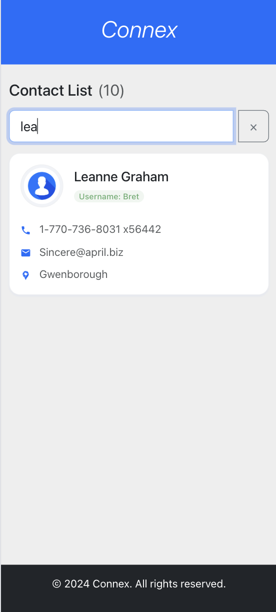

### Project Title: Connex Contacts List App

**Description:**
This React-based application displays a list of contacts fetched from an API. It includes a search functionality to filter contacts utilize real-time state management.

**Technologies Used:**
- **Frontend:** React
- **State Management:** `useState, useEffect` hooks
- **Styling:** Bootstrap
- **Data Fetching:** `axios` API (or a suitable alternative like `fetch`)
- **Users API:** [https://jsonplaceholder.typicode.com/users]

**Prerequisites:**
- Node.js and npm (or yarn) installed on your system.

**Installation:**
1. Clone the repository:
   ```bash
   git clone https://github.com/asin211/connex-contacts-app.git
   ```

2. Navigate to the project directory:
   ```bash
   cd connex-contacts-app
   ```

3. Install dependencies:
   ```bash
   npm install
   ```

**Running the Application:**
1. Start the development server:

   ```bash
   npm start
   ```
2. Open your web browser and navigate to `http://localhost:3000`.

**Hosted Demo:**
[https://asin211.github.io/connex-contacts-app/]

**Usage:**
- **Fetching data from API:** Fetch and Access data from API.
- **Search Contact by Name:** Utilize real-time state management to search and display user contact details.


**Contributing:**
Contributions are welcome! Please follow these guidelines:
1. Fork the repository.
2. Create a new branch.
3. Make your changes.
4. Submit a pull request.

**License:**
[Feel free to use for personal/learning purposes.]

## Screenshots
### Desktop View
<br>
<br>

### Tablet View
<br>
<br>

### Mobile View
<br>
<br>